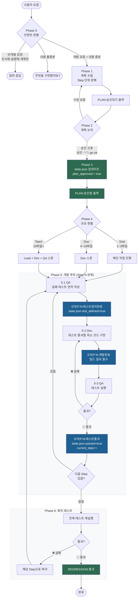

# ai-bouncer Dev Flow

```mermaid
flowchart TD
    A([사용자 요청]) --> B{Phase 0\n인텐트 판별}

    B -->|비개발 요청\n조사해·설명해·계획만| Z([일반 응답])
    B -->|내용 불충분| Y([무엇을 구현할까요?])
    B -->|개발 요청 + 내용 충분| C

    C[Phase 1\n계획 수립\nStep 단위 분해] --> D[PLAN:승인대기 출력]
    D --> E{Phase 2\n계획 논의}
    E -->|수정 요청| C
    E -->|승인 신호\n승인·ㄱㄱ·go·ok| F

    F[Phase 3\nstate.json 업데이트\nplan_approved = true] --> G[PLAN:승인됨 출력]
    G --> H{Phase 4\n규모 판별}

    H -->|Solo\n1~3파일| I[메인 직접 진행]
    H -->|Duo\n4~10파일| J[Dev 스폰]
    H -->|Team\n10파일+| K[Lead + Dev + QA 스폰]

    I & J & K --> L

    subgraph LOOP["Phase 5: 개발 루프 (Step N 반복)"]
        direction TB
        L[5-1 QA\n실패 테스트 먼저 작성] --> M[STEP:N:테스트정의완료\nstate.json test_defined=true]
        M --> N[5-2 Dev\n테스트 통과할 최소 코드 구현]
        N --> O[STEP:N:개발완료\n빌드 결과 필수]
        O --> P[5-3 QA\n테스트 실행]
        P --> Q{통과?}
        Q -->|❌ 실패| N
        Q -->|✅ 통과| R[STEP:N:테스트통과\nstate.json passed=true\ncurrent_step++]
        R --> S{다음 Step\n있음?}
        S -->|있음| L
    end

    S -->|없음| T

    subgraph REG["Phase 6: 회귀 테스트"]
        T[전체 테스트 재실행] --> U{통과?}
        U -->|❌ 실패| V[해당 Step으로 복귀]
        U -->|✅ 통과| W[REGRESSION:통과]
    end

    V --> L
    W --> X([완료])

    style F fill:#2d6a4f,color:#fff
    style G fill:#2d6a4f,color:#fff
    style M fill:#1e6091,color:#fff
    style O fill:#1e6091,color:#fff
    style R fill:#1e6091,color:#fff
    style W fill:#2d6a4f,color:#fff
    style LOOP fill:#f8f9fa,stroke:#dee2e6
    style REG fill:#f8f9fa,stroke:#dee2e6
```
