# ai-bouncer Dev Flow (v4)

```mermaid
flowchart TD
    A([사용자 요청]) --> B[Phase 0\nintent 에이전트\n인텐트 판별]

    B -->|일반응답| Z([일반 응답])
    B -->|내용불충분| Y([되물음])
    B -->|개발요청| C

    C[TASK_DIR 초기화\ndocs/.active 생성\nstate.json 초기화] --> D

    subgraph PLAN["Phase 1: Planning Team (planner-lead + planner-dev + planner-qa)"]
        direction TB
        D[팀 구성 및 컨텍스트 전달] --> E
        E{질문 생성 시도} -->|질문 있음\nno_question_streak = 0| F[사용자에게 질문]
        F --> G[사용자 답변 수신]
        G --> E
        E -->|질문 없음\nno_question_streak ++| H{streak >= 3?}
        H -->|아니오 재시도| E
        H -->|예\n3회 연속 질문 없음| I[계획 확정\ndocs/plan.md 작성]
    end

    I --> J[PLAN:승인대기\n사용자에게 계획 표시]
    J --> K{Phase 2\n승인?}
    K -->|수정 요청| D
    K -->|승인| L[PLAN:승인됨\nstate.json 업데이트]

    L --> M[Phase 3\nlead 에이전트 스폰]
    M --> N[팀 규모 종합 판단\nTEAM:solo/duo/team]
    N --> O[개발 Phase 분해\ndocs/phase-N-name/phase.md 작성\nDEV_PHASES:확정]

    subgraph DEV["Phase 3: 개발 루프 (Phase/Step 반복)"]
        direction TB
        P[5-1 QA\n실패 TC 먼저 작성\nstep-M.md TC 섹션] --> Q[STEP:N:테스트정의완료\ntest_defined = true]
        Q --> R[5-2 Dev\n최소 코드 구현\nstep-M.md 구현 섹션]
        R --> S[STEP:N:개발완료\n빌드 결과 필수]
        S --> T[5-3 QA\n테스트 실행\nstep-M.md 결과 섹션]
        T --> U{통과?}
        U -->|❌ 실패| R
        U -->|✅ 통과| V[STEP:N:테스트통과\npassed = true]
        V --> W{다음 Step?}
        W -->|있음| P
        W -->|없음| X[ALL_STEPS:완료]
    end

    O --> P
    X --> VER

    subgraph VER["Phase 4: 연속 3회 검증 루프 (시도 횟수 제한 없음)"]
        direction TB
        VA[verifier 에이전트] --> VB[docs/plan.md 대비 구현 검증\n문서 완결성 확인\n전체 테스트 재실행]
        VB --> VC[verifications/round-N.md 작성]
        VC --> VD{결과?}
        VD -->|❌ 실패\nrounds_passed = 0 리셋| VE[재작업 지시\n해당 Step으로 복귀]
        VE --> P
        VD -->|✅ 통과\nrounds_passed ++| VF{rounds_passed = 3?}
        VF -->|아니오 재검증| VA
        VF -->|예 3회 연속 통과| VG[DONE]
    end

    VG --> END([완료\ndocs/.active 정리])

    style C fill:#1e6091,color:#fff
    style L fill:#2d6a4f,color:#fff
    style Q fill:#1e6091,color:#fff
    style S fill:#1e6091,color:#fff
    style V fill:#1e6091,color:#fff
    style VG fill:#2d6a4f,color:#fff
    style PLAN fill:#f8f9fa,stroke:#dee2e6
    style DEV fill:#f8f9fa,stroke:#dee2e6
    style VER fill:#f8f9fa,stroke:#dee2e6
```



## 에이전트 구성

| Phase | 에이전트 | 역할 |
|---|---|---|
| 0 | `intent` | 인텐트 판별 |
| 1 | `planner-lead` | Planning Team 리드, Q&A 루프 |
| 1 | `planner-dev` | 기술 관점 기여 |
| 1 | `planner-qa` | 품질/테스트 관점 기여 |
| 3 | `lead` | 팀 규모 판단, Phase 분해, 오케스트레이션 |
| 3 | `dev` | 구현 |
| 3 | `qa` | TC 작성 + 테스트 실행 |
| 4 | `verifier` | 종합 검증 + 3회 루프 |

## 문서 구조

```
docs/
├── .active                    # 현재 활성 작업 이름
└── <task-name>/
    ├── plan.md                # Phase 1: 고수준 계획
    ├── state.json             # 작업 상태
    ├── phase-1-<feature>/
    │   ├── phase.md           # 개발 Phase 범위
    │   ├── step-1.md          # TC + 구현 + 테스트 결과
    │   └── step-2.md
    └── verifications/
        ├── round-1.md
        └── round-2.md
```
