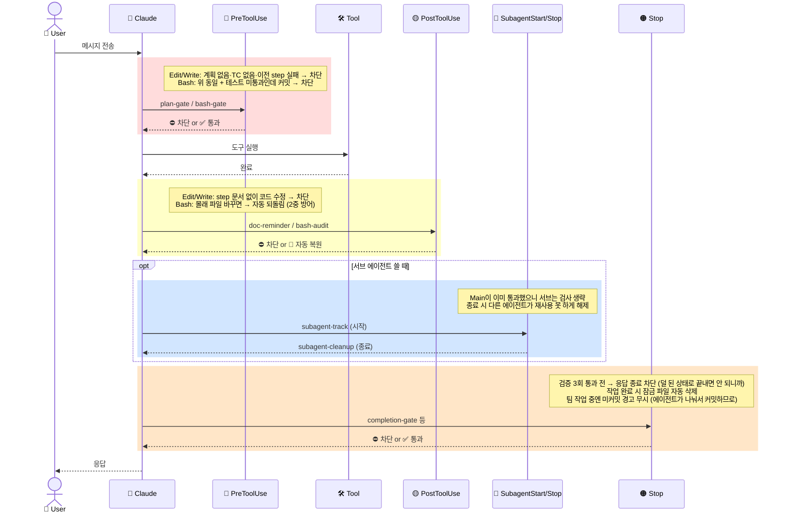

# ai-bouncer Hook 생명주기

Claude Code 생명주기에서 각 훅이 언제, 무엇을 하는지 정리한 다이어그램.

---

## 생명주기 이벤트별 훅

### 🔴 PreToolUse — `plan-gate` (Edit/Write) · `bash-gate` (Bash)
→ 하나라도 불충족 시 ⛔ 도구 실행 차단

| 검사 항목 | 이유 |
|---|---|
| 계획을 세우고 승인받았어? | 계획도 없이 코드 바꾸면 안 되니까 |
| TC(테스트 기준)가 작성됐어? | 테스트 기준도 없이 구현하면 안 되니까 |
| 이전 step 테스트 통과했어? | 망가진 상태에서 다음 단계 가면 안 되니까 |
| 팀이 구성됐어? _(NORMAL + team 모드만)_ | 에이전트 없이 개발 단계 진입하면 안 되니까 |
| 테스트 미통과인데 커밋? _(Bash만)_ | 안 되는 코드 커밋하면 안 되니까 |

### 🟡 PostToolUse — `doc-reminder` (Edit/Write)
→ step 문서 없으면 ⛔ 차단

| 검사 항목 | 이유 |
|---|---|
| step 문서가 존재해? | 문서 없이 코드만 바꾸면 추적이 안 되니까 |

### 🟡 PostToolUse — `bash-audit` (Bash)
→ 무단 변경 감지 시 🔄 자동 되돌림 (차단 아님)

| 검사 항목 | 이유 |
|---|---|
| 몰래 파일 바꿨어? | PreToolUse를 우회하는 걸 막기 위한 2중 방어 |

### 🔵 SubagentStart / SubagentStop — `subagent-track` · `subagent-cleanup`
→ 차단 없음 — 추적만

| 시점 | 동작 | 이유 |
|---|---|---|
| 서브 에이전트 시작 | 검사 생략 처리 | Main이 이미 통과했으니 서브가 또 막힐 필요 없으니까 |
| 서브 에이전트 종료 | 생략 처리 해제 | 다른 에이전트가 면제를 재사용하지 못하게 |

### 🟠 Stop — `completion-gate`
→ 검증 미완료 시 ⛔ 응답 종료 차단

| 검사 항목 | 이유 |
|---|---|
| 검증 3회 연속 통과했어? | 덜 된 상태로 작업 종료하는 걸 막기 위해 |

### 🟠 Stop — `stop-active-cleanup` · `stop-bouncer-compat`
→ 차단 없음 — 정리/스킵만

| 동작 | 이유 |
|---|---|
| 작업 완료 시 잠금 파일 자동 삭제 | 완료 후 다음 작업이 잠겨있으면 안 되니까 |
| 팀 작업 중엔 미커밋 경고 무시 | 에이전트가 나눠서 커밋하므로 오탐 방지 |

---

## 생명주기 흐름도

