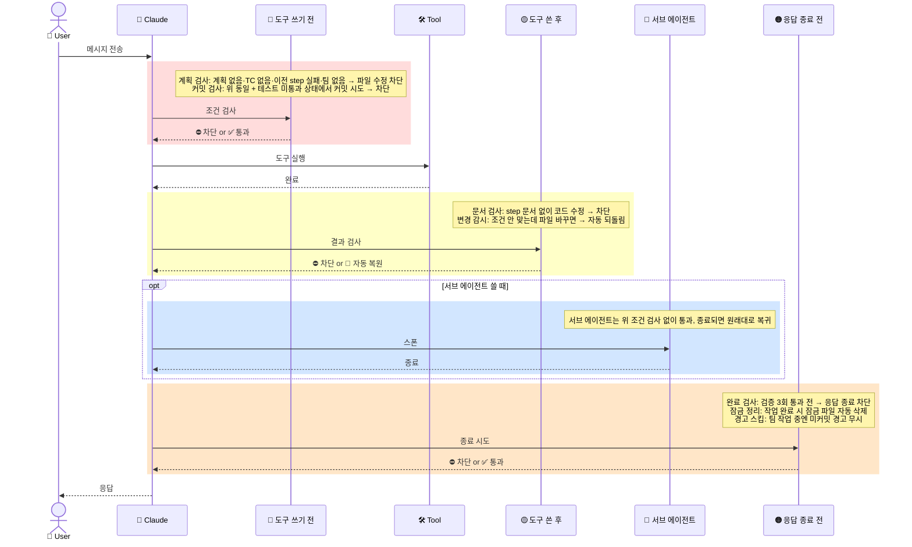

# ai-bouncer Hook Lifecycle

Claude Code 생명주기에서 각 훅이 언제, 무엇을 하는지 정리한 다이어그램.

---

## 훅 목록

| Hook | 시점 | 하는 일 |
|---|---|---|
| `plan-gate` | 파일 수정 전 | 계획·TC·이전 step 통과 여부 확인 → 안 맞으면 차단 |
| `bash-gate` | 터미널 명령 전 | 위 동일 + 테스트 미통과 상태에서 커밋 시도 차단 |
| `doc-reminder` | 파일 수정 후 | step 문서가 없으면 차단 |
| `bash-audit` | 터미널 명령 후 | 조건 안 맞는데 파일이 바뀌어 있으면 자동으로 되돌림 |
| `subagent-track` | 서브 에이전트 시작 시 | 서브 에이전트에게 조건 검사 면제 부여 |
| `subagent-cleanup` | 서브 에이전트 종료 시 | 면제 회수 |
| `completion-gate` | 응답 종료 전 | 검증 3회 통과 안 했으면 응답 종료 차단 |
| `stop-active-cleanup` | 응답 종료 전 | 작업 완료 시 잠금 파일 자동 삭제 |
| `stop-bouncer-compat` | 응답 종료 전 | 팀 작업 중엔 미커밋 경고 무시 |

---

## 생명주기 흐름도

---

## Block 조건 요약

### 🔴 plan-gate / bash-gate (PreToolUse)

| 조건 | phase | 모드 |
|---|---|---|
| `workflow_phase` 알 수 없는 값 | any | any |
| state.json을 `done`/`verification`으로 직접 변경 | planning | any |
| `plan_approved != true` | development / verification | any |
| `plan.md` 없음 | development / verification | any |
| `team_name` 비어있음 | development | normal · team |
| 팀 config.json 없음 | development | normal · team |
| 팀 멤버 수 < 1 | development | normal · team |
| `dev_phases` 비어있음 | development | normal |
| `current_dev_phase <= 0` or `current_step <= 0` | development | normal |
| 이전 Phase 미완료 (step에 ✅ 없음) | development | normal |
| `phase.md` 없음 | development | normal |
| `phase.md` 필수 섹션 누락 (`## 목표` / `## 범위` / `## Steps`) | development | normal |
| 이전 step-N.md 없음 | development | normal |
| 이전 step-N.md에 ✅ 없음 | development | normal |
| 이전 step-N.md에 실행출력 없음 | development | normal |
| 현재 step-N.md 없음 | development | normal |
| 현재 step-N.md에 TC 행 없음 | development | normal |
| 미완료 Phase 존재 (step에 ✅ 없음) | verification | normal |

**bash-gate 추가 조건 (git commit/push 시):**

| 조건 | commit_strategy |
|---|---|
| `commit_strategy=none` | none |
| `workflow_phase=planning` 중 커밋 | any |
| verification + 미완료 Phase | any |
| 현재 step ✅ 없음 | per-step |
| 마지막 step ✅ 없음 | per-phase |

### 🟡 doc-reminder (PostToolUse)

| 조건 | phase |
|---|---|
| step의 `doc_path` 문서 파일이 없음 | development |

### 🟡 bash-audit (PostToolUse)

Block 없음. bash-gate 스냅샷 대비 무단 변경 파일을 **자동 복원**:
- tracked 파일 → `git checkout` 복원
- untracked 파일 → `rm` 삭제

### 🟠 completion-gate (Stop)

| 조건 | 모드 |
|---|---|
| `plan_approved=true` + phase가 done/cancelled 아님 | simple |
| `plan_approved=true` + development + 진행 중 Phase 있음 | normal |
| verification + `round-*.md` < 3개 | normal |
| verification + 마지막 3 round 연속 통과 < 3 | normal |

> round 통과 조건: `통과` 포함 + `실패` 미포함 + `## 결론` 섹션 존재

---

## 색깔 범례

| 색깔 | 의미 |
|---|---|
| 🔴 빨강 (Pre) | 아예 실행 못 하게 막음 |
| 🟡 노랑 (Post) | 실행은 됐지만 결과를 되돌림 |
| 🔵 파랑 (Sub) | gate 면제권 부여/회수 |
| 🟠 주황 (Stop) | 턴 자체를 못 끝내게 막음 |
