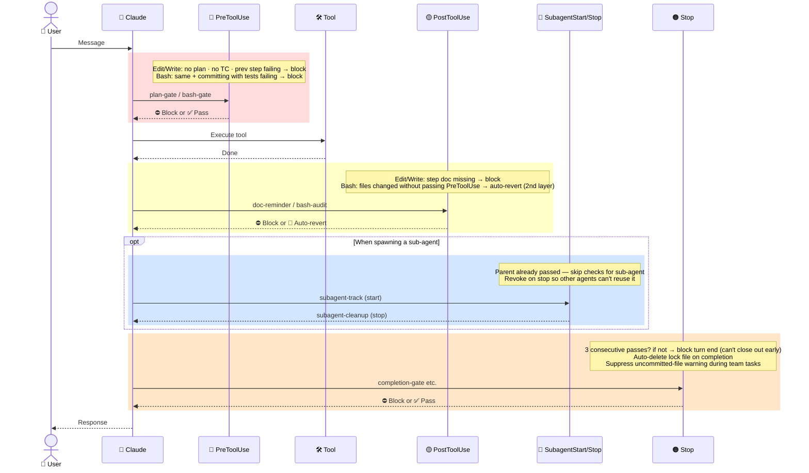

# ai-bouncer Hook Lifecycle

How each hook fires across the Claude Code lifecycle.

---

## Hooks by lifecycle event

### 🔴 PreToolUse — `plan-gate` (Edit/Write) · `bash-gate` (Bash)
→ any check fails → ⛔ blocks tool execution

| Check | Why |
|---|---|
| Plan approved? | No editing without an approved plan |
| TC defined for this step? | No implementation without test criteria |
| Previous step tests passing? | No moving forward from a broken state |
| Team assembled? _(NORMAL + team mode only)_ | No dev phase without agents in place |
| Committing with tests failing? _(Bash only)_ | No committing broken code |

### 🟡 PostToolUse — `doc-reminder` (Edit/Write)
→ step doc missing → ⛔ blocks

| Check | Why |
|---|---|
| Step doc exists? | Code changes without docs can't be traced |

### 🟡 PostToolUse — `bash-audit` (Bash)
→ unauthorized change detected → 🔄 auto-reverts (no block)

| Check | Why |
|---|---|
| Files changed without passing PreToolUse? | 2nd layer to catch any PreToolUse bypass |

### 🔵 SubagentStart / SubagentStop — `subagent-track` · `subagent-cleanup`
→ no block — tracks only

| Event | Action | Why |
|---|---|---|
| Sub-agent starts | Grant bypass | Parent already passed all checks — re-blocking would be a false positive |
| Sub-agent stops | Revoke bypass | Prevent other agents from reusing the exemption |

### 🟠 Stop — `completion-gate`
→ verification incomplete → ⛔ blocks response

| Check | Why |
|---|---|
| 3 consecutive verification passes? | Prevents closing out before work is fully done |

### 🟠 Stop — `stop-active-cleanup` · `stop-bouncer-compat`
→ no block — cleanup / skip only

| Action | Why |
|---|---|
| Auto-delete lock file on completion | Next task shouldn't be blocked by a stale lock |
| Suppress uncommitted-file warning during team tasks | Agents commit in parallel — warning would be a false positive |

---

## Lifecycle flow

